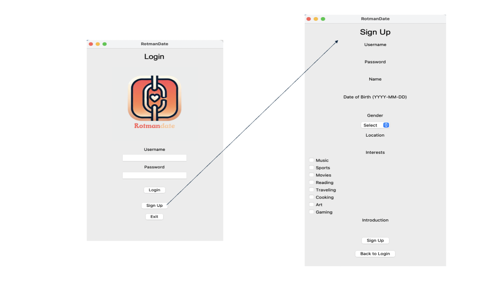
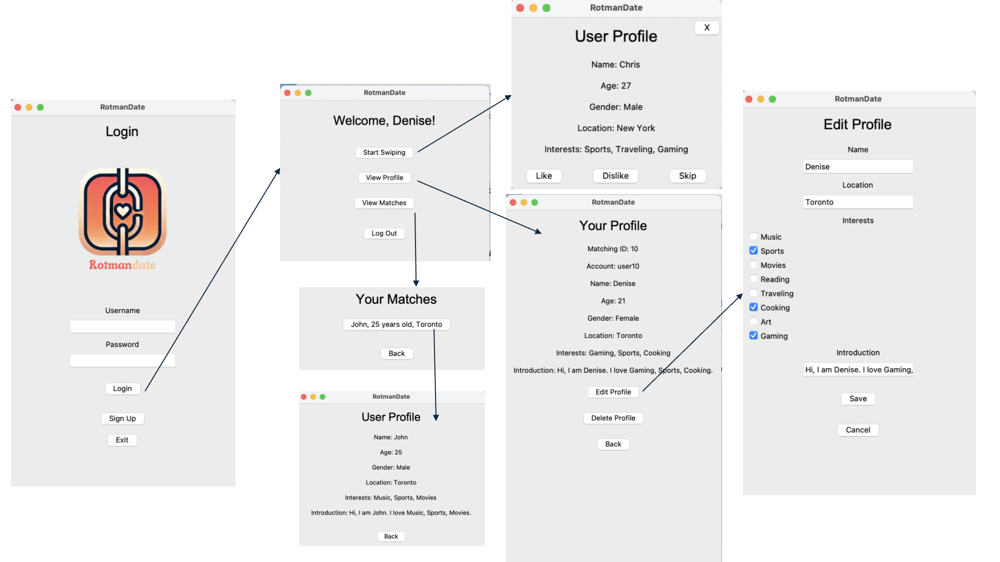

# Romantic Matching App

Rotmantic is a dating application facing Rotman students. This project allows users to create accounts, swiping to find other interesting user, interact with other users (e.g., like, dislike), and view matches. It also allows users to edit and delete their account profile. The application includes both a command-line interface (CLI) and a graphical user interface (GUI) for user interaction. The project is structured with four main Python files:
+ user.py
+ database.py
+ main.py
+ gui.py

## Table of Content
1. Project Structure
2. Usage
3. Acknowledgements

## Project Structure

### 1. `user.py` file 

This file defines the `User` class, which employs Object-Oriented Programming principles to manage the attributes for each user in the system. Key features including:
+ Attributes:
    + `user_id (str)`: Unique identifier for each user.
    + `account (str)`: The username associated with the user’s account.
    + `password (str)`: The user's password.
    + `name (str)`: The user's real name.
    + `age (int)`: The user's age.
    + `gender (str)`: The user's gender.
    + `location (str)`: The user's location.
    + `interests (list)`: A list of the user’s interests, stored as strings.
    + `introduction (str)`: the bio for the user.
    + `liked_users （list)`: A list of user IDs that the user has liked.
    + `disliked_users (list)`: A list of user IDs that the user has disliked.
    + `matches (list)`: A list of user IDs that have mutually liked each other (i.e., matches).

+ Methods: 
    + `like()`: Allows a user to like another user, and adjust the weight for the chosen attribute (to make recommendation) by 1.1. If there is a mutual like, a match is created.
    + `dislike()`: Allows a user to dislike another user, and adjust the weight for the chosen attribute (to make recommendation) by 0.9.
    + `update_weight()`: Adjusts the weight of the chosen attribute.
    + `get_attribute_weights()`: Extract attribute weights.
    + `assign_attribute_weights()`: Assign attribute weights.

### 2. `database.py`

This file creates the database integration system, using the Python `SQLite` library. It provides essential operations (Create, Read, Update and Delete) to interact with the sqlite database. The main functions and their roles are as follows:

- `create_connection()`:
  - Creates a connection to the SQLite database

- `create_tables()`:
  - Creates the `users` table in the database if it does not already exist. The table includes the following columns:
    - `user_id`: Primary key, auto-incremented for each user.
    - `username`: The unique username associated with the user’s account.
    - `password`: The user's password.
    - `name`: The user's real name.
    - `age`: The user's age.
    - `gender`: The user's gender.
    - `location`: The user's location.
    - `interests`: A comma-separated string representing the user’s interests.
    - `introduction`: A brief introduction or bio for the user.
    - `liked_users`: A comma-separated string of user IDs that the user has liked.
    - `disliked_users`: A comma-separated string of user IDs that the user has disliked.
    - `matches`: A comma-separated string of user IDs that have mutually liked each other.
    - `attribute_weights`: A JSON string storing the weights assigned to different user attributes for matching purposes.

- `add_user(username, password, name, age, gender, location, interests, introduction)`:
  - Inserts a new user into the `users` table with the provided information.
  - Initializes the `attribute_weights` with default values for `age`, `gender`, `location`, `introduction`, and user-defined `interests`.

- `get_user(username)`:
  - Retrieves a user’s data from the database using their username. This function will be use in main.sign_in() to
  validate user account and password.
  - Returns the user’s data as a tuple.

- `get_user_by_id(user_id)`:
  - Retrieves a user's data from the database using their `user_id`.
  - Reconstruct `attribute_weights` from its JSON string format to dictionary type.
  - Returns the `User` object, or `None` if the user does not exist.

- `get_all_users()`:
  - Fetches all users from the `users` table.
  - Converts each user’s data into a `User` object, including the reconstruction of `attribute_weights` from their JSON string format.
  - Returns a list of `User` objects.

- `delete_user(user_id)`:
  - Removes a user from the `users` table by their `user_id`.
  - Before deletion, the function updates the `liked_users`, `disliked_users`, and `matches` fields of other users to ensure consistency in the database.

- `update_user(user)`:
  - Updates an existing user's data in the database based on the current state of the `User` object provided as input.
  - Ensures that `liked_users`, `disliked_users`, and `matches` are stored as comma-separated strings, and `attribute_weights` as a JSON string.

### 3. `main.py` 

This file defines our command line interface, it creates welcome menu, user menu, allows user to swipe, edit and delete its profile, and view matches. The main functions and their roles are as follows:

+ `welcome()`: Displays the welcome message and the main menu options: Sign In, Sign Up, and Exit.
+ `sign_up()`: a function that asks user to input the basic information(account, password, name, age, gender, location, interest, introduction) to create a new profile and ensures the user is not an existing user. After registration, the program prompts the current user to sign in.
+ `sign_in()`: Ask users to enter their account and password, if validate, returns a User object for the current user.
+ `main()`: The main loop of the program that displays the user menu and navigate between sign-up, sign-in, and exit options.
+ `user_menu()`: When signing in successfully, the function user_menu will be called to print out 4 options "Start swiping", "Your Own Profiles", "View matches", and "Log out" for the user to choose. 
    +  If the user chooses "Start swiping", `start_swiping(current_user)` will be called. This function asks the user to choose "like, dislike, or skip" on the recommended user, and the `recommend(current_user, all_users)` function is called inside the `start_swiping(user)`. It selects one attribute by probability based on the weight of each attribute, picks up a list of users who have the same selected attribute as the current user, and randomly recommends a user from the list to the current user. If introduction is the selected attribute, the function `semantic_similarity(text1, text2)` willed be called to calculate the semantic similarity between two users' introductions. Similar introductions are matched based on the semantic similarity score. If the user likes the recommended user, the recommended user will be added into the liked_users list of the current user. Vice versa.
    + If the user chooses "Your Own Profiles",  `view_own_profile(user)` is called. This function prints the profile of the user and provides 3 options "Edit Profile", "Delete Profile", and "Go back" for the user. If the user chooses "Edit Profile", `edit_profile()` function is called to present the user current profile and modify the profile based on the user's input. 
    + If the user chooses "View matches", `view_matches(user)` will be called. This function adds the mutual users to the match list and shows the matching result to the user

### 4. `gui.py` 
This file defines the graphical user interface (GUI) for the Rotmantic app using the `Tkinter` library. It provides an intuitive interface for users to interact with the app. Below are the main components and their roles:

+ `RotmanticApp` Class: The main class that manages the entire GUI application, handling user interactions and transitions between different screens.

    + `__init__(self, root)`: Initializes the main window, sets up the application title, dimensions, and the initial screen.

    + `create_login_screen()`: Displays the login screen where users can enter their username and password. Provides options to log in, sign up, or exit the application.

    + `create_signup_screen()`: Presents the sign-up form where new users can register by entering their details like username, password, name, date of birth, gender, location, interests, and introduction.

    + `login()`: Validates user credentials against the database. If valid, it proceeds to the user menu; otherwise, it displays an error message.

    + `sign_up()`: Handles the user registration process, including input validation, and stores the new user in the database.

    + `create_user_menu()`: Displays the user menu after successful login, offering options to start swiping, view profile, view matches, or log out.

    + `start_swiping()`: Initiates the swiping feature where users can browse through recommended profiles and choose to like, dislike, or skip them.

    + `show_next_user_swiping()`: Displays the next user profile for swiping and handles user actions such as like, dislike, or skip.

    + `skip_user_and_continue()`: Allows users to skip a profile without making a decision, and proceed to the next profile.

    + `view_profile()`: Allows the user to view their profile information, including personal details, interests, and introduction.

    + `edit_profile()`: Enables users to modify their profile information, including name, location, interests, and introduction.

    + `delete_profile()`: Provides the option to delete the user's profile permanently after confirmation.

    + `view_matches()`: Displays a list of all users who have mutually liked each other, and allows the user to view detailed profiles of their matches.

    + `show_match_profile()`: Displays the profile of a matched user, providing details such as name, age, gender, location, interests, and introduction.

    + `like_user()`: Handles the action of liking a user during swiping and updates the database accordingly.

    + `dislike_user()`: Handles the action of disliking a user during swiping and updates the database accordingly.

    + `no_more_users()`: Informs the user when there are no more profiles available to swipe.

+ `clear_screen()` and `clear_swipe_window()`: Utility functions to clear the current screen or swiping window before displaying new content.

+ Additional Features
    + Error Handling: The application includes error handling for invalid inputs, such as an incorrect date of birth format or an existing account during sign-up.
    + Popup Messages: Uses Tkinter's messagebox to display information, success, and error messages to the user.

### 5. `resetdata.py`* 

This file is intended to provide some dummy users for testing purpose. It will delete the existing database (if exist) and reset the database. The key functions are provided below:

  + clean_database(): Deletes the specified database file to reset the database.
  + create_dummy_users(): Creates and inserts 10 dummy users into the database one by one.

**Note:** that this file is not being called in any of the files (user.py, database.py, main.py and gui.py) listed above.

## Usage

First, refer to `requirements.txt` to make sure all dependencies are correctly satisfied. The following contents describes the usage via Command Line Interface (run the `main.py` file) and Graphical User Interface (run the `gui.py` file):

### Command Line Interface (CLI)

Command Line Interface is our first iteration of the application. It is used as a benchmark to internal workflow. The final product is our GUI.

### Graphical User Interface (GUI)

The graphical user interface is our final product and we recommend users to run `gui.py` instead of `main.py` as it offers more convenient user interactions. To use GUI version, navigate to the project directory in your Python IDE, and run the `gui.py` file. This will prompt out the Rotmantic Application Window, and the user can interact with the app. See following illustration for features preview:

+ Sign in/Sign up Window: 

+ Interactions:

**NOTE:** For developer who wants to test the program, run `resetdata.py` first to generate 10 dummy users.

## Acknowledgements

This project utilized ChatGPT-4 by OpenAI to assist in generating the initial structure and for debugging support. 